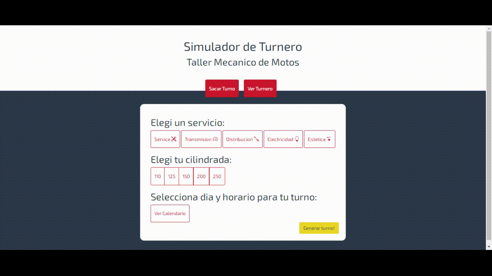

# Información del Proyecto
## Descripción del Proyecto

Proyecto final del curso de JavaScript de CoderHouse.
Este proyecto es un generador de turnos virtual, diseñado para administradores o secretarios de talleres de reparación de motocicletas.
El proyecto usa librerias como [Sweet Alert](https://sweetalert2.github.io/), [Animate.css](https://animate.style/) y [Bootstrap](https://getbootstrap.com/).
Para el trabajo con APIs diseñé una fake api en [mockapi.io](https://mockapi.io/projects).

## Librerias Utilizadas
- Bootstrap: v5.1.3
- Bootstrap Icons: v1.8.1
- Sweet Alert: v11.4.14 
- Animate.css: v4.1.1

## Conocimientos propios de JavaScript aplicados al Proyecto
- Variables simples: strings, numbers, booleans
- Variables complejas: arrays, objects y functions
- Control de flujos: if, for, while, switch, ...
- Métodos de arrays: forEach, find, filter, some, ...
- Add/Remove classList
- SetTimeOut
- Event Listeners
- Fetch: Get y Post

## Flujo de navegacion del Turnero
1. En la página principal, se encuentran los botones de "Sacar Turno" y "Ver Turnero", que seleccionan las posibles pantallas del Simulador. Por defecto se muestra "Sacar Turno".
2. En la pestaña "Sacar Turno", tenemos disponibles los botones de selección de Servicio y Cilindrada. Tambien, un boton "Ver Calendario", el mismo despliega el calendario donde se seleccionan el dia y horario para el turno.
3. Una vez seleccionados el servicio, la cilindrada, el dia y la hora del turno, al presionar el boton "Generar turno" se guarda el mismo y se muestra la informacion.
4. En la pestaña "Ver Turnero" se muestra el calendario con los dias y horarios ocupados, al hacer click en alguno de ellos, se muestra la info de los t

## Demos del Funcionamiento del Turnero
### Demo de la página inicial "Sacar Turnos"

### Demo de la página "Ver Turnero"

